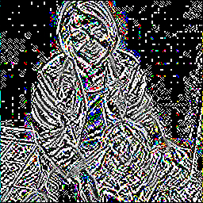

# Image Processing using CUDA

This is my final project for CPSC-479 High Performance Computing at CSUF. This project will perform image convolution operations using Nvidia's CUDA platform.

To run this project, you MUST have the CUDA platform installed. 
Here are the steps to compile and execute:
1. Clone this project
2. Use CMake to build the project for your appropriate environment by either using the Cmake GUI or the CLI.
3. Before you can run the program, download an 256x256 .jpg image you would like to change.
4. Run the program by providing the path to your image as the first command line argument and the path to the new image as the second command line argument.

## TODO:
* Handle different sized images
* Use different types of images other than .jpg
* Implement different image convolution kernels
* Refactor image conversion implementation
* Expand CLI

## Examples:
Original Image

New Image after Edge Detection Kernel applied

